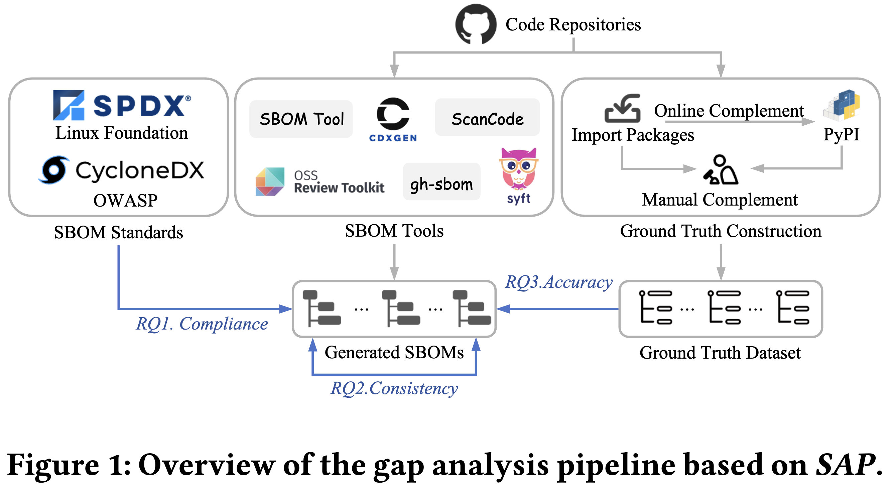

This is a anonymous open source repository for paper "A Large Scale Empirical Analysis on the Adherence Gap between Standards and Tools in SBOM"

## Introduction

Software bill of materials (SBOM) is a structured document that stores software information into multiple data fields. It can be utilized to enhance transparency and security in software supply chains by recording dependencies and their information. To help exchange and utilize the SBOM, normative organizations propose SBOM standards that comprehensively define structures and data fields for the SBOM. Following these standards, applied organizations implement tools for generating and utilizing the SBOM. However, limited studies exist on investigating whether these applied SBOM tools fully adhere to normative standards.

This paper analyzes the adherence gap between standards and tools in SBOM. To make the analysis, we design and implement SAP, a framework for evaluating SBOM tools against SBOM standards in real-world. Utilizing SAP, we conduct comprehensive evaluations on 3,287 real-world repositories. The results show that SBOM tools achieve 100\% adherence with mandatory data fields defined by SBOM standards, enabling basic interoperability. But three major gaps are found in compliance, consistency and accuracy of SBOM tools against standards.
We explore root causes contributing to these gaps and offer a discussion on potential solutions to help improve both SBOM standards and tools.



## Usage

All the results in paper are in the `results` folder. The ground truth dataset is in `benchmark-python.zip`, also, the unzipped files are at benchmark-python folder. 

We upload all the 26,194 SBOMs anonymously at [[here](https://ufile.io/pizy0zdp)(around 50GB after unzip)]. We upload the replication docker image that contains all the installed environments of the SBOM tools anonymously at [[here](https://hub.docker.com/repository/docker/d32s3a/anonymous-opensource/)], you can get it by the following command:

```bash
docker pull d32s3a/anonymous-opensource:1.0
```

Use `conda env list` to see all the environments of SBOM tools. The `ort` is at `/all-sbom-tools/ort-35.0.0/ort/cli/build/install/ort/bin/ort`(name with 35.0.0 but it is 36.0.0 as described in paper). The other tools can run directly with its name in their corresponding conda envs. All the scripts in SAP for SBOM generation locate at `run-sbom-tools` folder. These scripts need to run in the docker except `cdxgen` that need to interact with docker thus runs on host.

Note: if you want to check all the SBOMs, download the zip file and unzip it into folder, put it together with code of this repo, mount the top folder into `/mnt` of the docker container.

**For fast check,** we provide a small dataset in the test-sboms folder for you to test the code. Download the `fast-check.zip`, and unzip it into `fast-check` folder, then following the instruction. The download link is at [[here](https://ufile.io/o4wdv4x5)], cheksums: SHA-1 DF1FCC54E48DB06464A13422E63C7CA20492F7A6.

The code of paper is in the code folder. It is divided into three parts as introduced in the paper: `extract.py`, `match.py` and `evaluate.py`. The code is written in Python, and the required packages are in `code/requirements.txt`. You can install the required packages by running the following command:
```bash
pip install -r requirements.txt
```

We provide a all-in-one script to run the code for assessing the consistency of SBOM tools in the transfrom application, you can run the following command to run the code:
```bash
python test-run.py
```

It contains the following steps:
1. Extracts required data fields of the SBOMs and reformat them into JSON files. 
2. Match the peer-to-peer information in different data fields of SBOMs.
3. Evaluate the paired information in the matched SBOMs with the evalutaion operation provided by the evaluta module.
4. Give some basic statistics and output the results in a format of CSV file.

The results of the `test-run.py` will be in the `results` folder.


## More details
The results in paper are as follows:


Compliance - C/C++

| tool      | name   | author | purl   | license | version | copyrightText | dependency relationship |
| --------- | ------ | ------ | ------ | ------- | ------- | ------------- | ----------------------- |
| syft      | 100.0% | 7.6%   | 59.8%  | 1.0%    | 59.8%   | 0.0%          | 100.0%                  |
| gh-sbom   | 100.0% | 0.0%   | 100.0% | 61.2%   | 100.0%  | 16.0%         | 100.0%                  |
| ort       | 100.0% | 0.0%   | 8.1%   | 4.9%    | 94.7%   | 94.0%         | 8.1%                    |
| sbom-tool | 100.0% | 82.5%  | 100.0% | 11.5%   | 100.0%  | 0.0%          | 100.0%                  |
| scancode* | 46.3%  | 9.9%   | 46.3%  | 46.3%   | 14.3%   | 1.0%          | 100.0%                  |
| cdxgen*   | 65.9%  | 5.1%   | 66.0%  | 7.5%    | 66.0%   | 0.0%          | 100.0%                  |


Compliance - Java

| tool      | name   | author | purl   | license | version | copyrightText | dependency relationship |
| --------- | ------ | ------ | ------ | ------- | ------- | ------------- | ----------------------- |
| syft      | 100.0% | 9.1%   | 93.2%  | 3.1%    | 93.2%   | 0.0%          | 100.0%                  |
| gh-sbom   | 100.0% | 0.0%   | 100.0% | 64.9%   | 100.0%  | 28.3%         | 100.0%                  |
| ort       | 100.0% | 0.0%   | 16.0%  | 15.0%   | 29.6%   | 77.3%         | 16.6%                   |
| sbom-tool | 100.0% | 93.3%  | 100.0% | 5.4%    | 100.0%  | 0.0%          | 100.0%                  |
| scancode* | 33.1%  | 2.9%   | 33.1%  | 33.1%   | 31.5%   | 0.0%          | 100.0%                  |
| cdxgen*   | 90.9%  | 0.6%   | 90.9%  | 23.0%   | 90.9%   | 0.0%          | 100.0%                  |


Compliance - Python

| tool      | name   | author | purl   | license | version | copyrightText | dependency relationship |
| --------- | ------ | ------ | ------ | ------- | ------- | ------------- | ----------------------- |
| syft      | 100.0% | 3.6%   | 50.6%  | 1.0%    | 50.6%   | 0.0%          | 100.0%                  |
| gh-sbom   | 100.0% | 0.0%   | 100.0% | 70.7%   | 100.0%  | 0.0%          | 100.0%                  |
| ort       | 100.0% | 0.0%   | 24.4%  | 22.9%   | 70.8%   | 82.1%         | 24.4%                   |
| sbom-tool | 100.0% | 62.1%  | 100.0% | 30.1%   | 100.0%  | 0.0%          | 100.0%                  |
| scancode* | 50.9%  | 39.2%  | 50.9%  | 50.9%   | 31.4%   | 0.4%          | 100.0%                  |
| cdxgen*   | 74.6%  | 41.9%  | 74.6%  | 43.0%   | 74.6%   | 0.0%          | 100.0%                  |


Consistency - C/C++

| tools             | pkgs  | version | purl  | license |
| ----------------- | ----- | ------- | ----- | ------- |
| syft+gh-sbom      | 8.2%  | 18.4%   | 18.1% | 0.1%    |
| syft+ort          | 1.2%  | 3.1%    | 2.5%  | 0.0%    |
| syft+scancode     | 0.5%  | 4.4%    | 5.2%  | 0.8%    |
| syft+cdxgen       | 10.7% | 28.1%   | 23.4% | 0.1%    |
| gh-sbom+ort       | 4.9%  | 8.7%    | 9.7%  | 1.9%    |
| gh-sbom+scancode  | 0.2%  | 3.1%    | 2.5%  | 0.3%    |
| gh-sbom+cdxgen    | 43.9% | 67.3%   | 73.9% | 1.7%    |
| ort+scancode      | 0.1%  | 0.4%    | 0.3%  | 0.3%    |
| ort+cdxgen        | 3.0%  | 5.8%    | 5.1%  | 0.3%    |
| scancode+cdxgen   | 1.0%  | 4.2%    | 6.3%  | 0.7%    |
| syft+gh-sbom      | 24.4% | 40.5%   | 29.3% | 0.0%    |
| syft+ort          | 0.6%  | 2.8%    | 2.6%  | 0.0%    |
| syft+sbom-tool    | 6.2%  | 12.4%   | 11.7% | 0.0%    |
| gh-sbom+ort       | 0.8%  | 2.7%    | 5.3%  | 0.0%    |
| gh-sbom+sbom-tool | 7.3%  | 11.2%   | 14.7% | 7.7%    |
| ort+sbom-tool     | 74.4% | 5.3%    | 5.4%  | 0.0%    |
| average           | 11.7% | 13.6%   | 13.5% | 0.9%    |


Consistency - Java

| tools             | pkgs  | version | purl  | license |
| ----------------- | ----- | ------- | ----- | ------- |
| syft+gh-sbom      | 34.6% | 56.3%   | 70.2% | 0.3%    |
| syft+ort          | 5.2%  | 12.9%   | 14.0% | 0.2%    |
| syft+scancode     | 1.3%  | 15.8%   | 15.7% | 0.6%    |
| syft+cdxgen       | 58.4% | 82.3%   | 71.3% | 0.3%    |
| gh-sbom+ort       | 20.3% | 48.1%   | 55.9% | 26.5%   |
| gh-sbom+scancode  | 2.8%  | 26.7%   | 30.6% | 0.7%    |
| gh-sbom+cdxgen    | 35.8% | 74.8%   | 76.4% | 24.0%   |
| ort+scancode      | 0.0%  | 0.7%    | 0.6%  | 0.2%    |
| ort+cdxgen        | 11.2% | 14.3%   | 11.8% | 6.1%    |
| scancode+cdxgen   | 1.6%  | 15.0%   | 13.3% | 4.0%    |
| syft+gh-sbom      | 6.1%  | 16.1%   | 11.9% | 0.0%    |
| syft+ort          | 2.1%  | 12.9%   | 13.8% | 0.0%    |
| syft+sbom-tool    | 3.2%  | 5.5%    | 5.5%  | 0.0%    |
| gh-sbom+ort       | 0.2%  | 0.6%    | 1.0%  | 0.0%    |
| gh-sbom+sbom-tool | 3.0%  | 4.9%    | 5.9%  | 4.0%    |
| ort+sbom-tool     | 9.8%  | 1.0%    | 1.0%  | 0.0%    |
| average           | 12.2% | 24.2%   | 24.9% | 4.2%    |


Consistency - Python

| tools             | pkgs  | version | purl  | license |
| ----------------- | ----- | ------- | ----- | ------- |
| syft+gh-sbom      | 21.8% | 42.4%   | 43.3% | 0.1%    |
| syft+ort          | 2.8%  | 6.4%    | 5.2%  | 0.0%    |
| syft+scancode     | 0.6%  | 2.4%    | 2.9%  | 1.1%    |
| syft+cdxgen       | 15.1% | 34.5%   | 34.4% | 0.2%    |
| gh-sbom+ort       | 18.8% | 15.5%   | 27.7% | 3.8%    |
| gh-sbom+scancode  | 0.2%  | 1.1%    | 2.7%  | 0.3%    |
| gh-sbom+cdxgen    | 47.4% | 52.0%   | 77.3% | 7.6%    |
| ort+scancode      | 0.0%  | 0.1%    | 0.2%  | 0.1%    |
| ort+cdxgen        | 14.9% | 24.2%   | 23.2% | 3.1%    |
| scancode+cdxgen   | 4.0%  | 2.8%    | 21.6% | 0.6%    |
| syft+gh-sbom      | 22.9% | 44.1%   | 37.7% | 0.0%    |
| syft+ort          | 1.0%  | 6.1%    | 6.0%  | 0.0%    |
| syft+sbom-tool    | 8.3%  | 21.5%   | 21.8% | 0.0%    |
| gh-sbom+ort       | 4.0%  | 4.0%    | 4.1%  | 0.0%    |
| gh-sbom+sbom-tool | 15.6% | 16.4%   | 16.4% | 14.0%   |
| ort+sbom-tool     | 47.1% | 13.8%   | 15.8% | 0.0%    |
| average           | 14.0% | 17.9%   | 21.3% | 1.9%    |


Accuracy - Python

| tools     | count | precision | recall | author | version | license |
| --------- | ----- | --------- | ------ | ------ | ------- | ------- |
| syft      | 100   | 17.7%     | 12.4%  | 0.0%   | 18.0%   | 0.0%    |
| gh-sbom   | 36    | 71.3%     | 55.1%  | 0.0%   | 66.6%   | 9.8%    |
| ort       | 84    | 12.0%     | 16.9%  | 0.0%   | 6.0%    | 14.0%   |
| scancode  | -     | -         | -      | -      | -       | -       |
| cdxgen    | 98    | 29.5%     | 42.5%  | 18.4%  | 15.5%   | 14.9%   |
| sbom-tool | 100   | 14.0%     | 23.6%  | 9.7%   | 10.8%   | 18.6%   |
